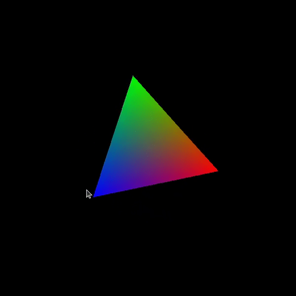

# Xlib + Vulkan 1.0

Build shaders:
```sh
glslangValidator -V triangle.vert -o triangle.vert.spv

glslangValidator -V triangle.frag -o triangle.frag.spv
```

Build:
```sh
gcc -Wall -o triangle main.c engine.c -lX11 -lvulkan -lm
```

Run:
```sh
./triangle
```

Result:

